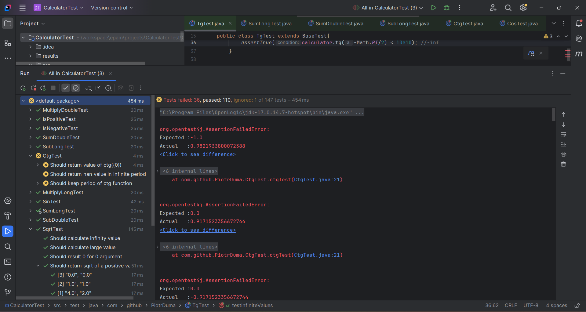
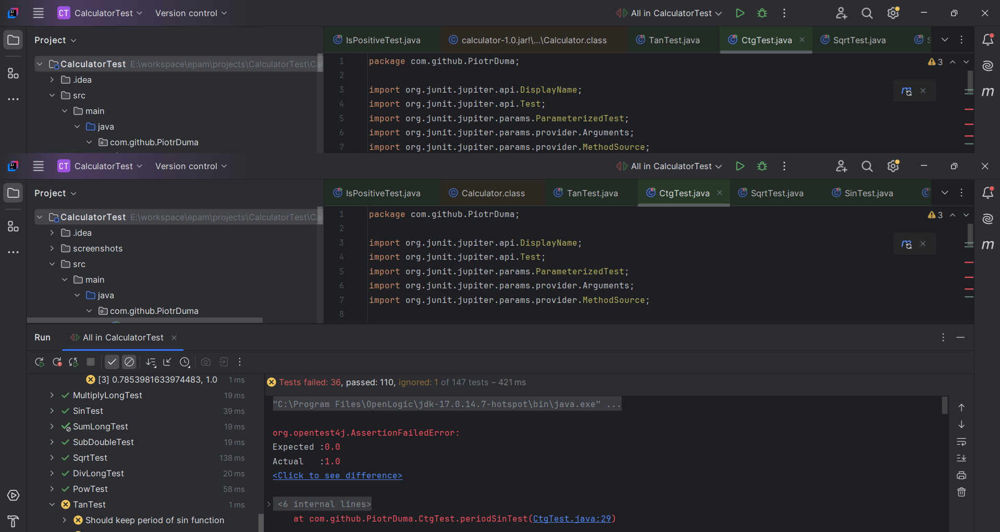

# CalculatorTest
Unit tests in jUnit5 of provided Calculator.jar

## Requirements of provided solution:

### Creating calculator object before each test excecution in base class:

~~~
public class BaseTest {
    protected Calculator calculator;
    @BeforeEach
    void setUp(){
        this.calculator = new Calculator();
    }
}
~~~

### Parallel execution in jUnit5: 

~~~
junit.jupiter.execution.parallel.enabled = true
junit.jupiter.execution.parallel.config.strategy = dynamic
junit.jupiter.execution.parallel.mode.default = concurrent
~~~

### Parametrized tests with data driven approach:

~~~
    @ParameterizedTest
    @MethodSource("dataSource")
    @DisplayName("Should pow two values")
    public void powTest(double a, double b, double expected){
        double result = calculator.pow(a, b);
        assertEquals(expected, result, 0.001);
    }
~~~

~~~
    @ParameterizedTest
    @DisplayName("Should round exponent positive number")
    @CsvSource({ //csv values just for training purposes
            "2.0, 2.99, 4.0",
            "2.0, 3, 8.0",
            "2.0, 3.01, 8.0",
            "2.0, -1.99, 0.25",
            "2.0, -2.0, 0.25",
            "2.0, -2.01, 0.125"})
    public void powRoundExponentNumberTest(double a, double b, double expected){
        assertEquals(expected, calculator.pow(a, b), 0.001);
    }
~~~

~~~
    private static Stream<Arguments> dataSource() {
        return Stream.of(
                arguments(0.0, 1.0, 0),
                arguments(2.0, 0.0, 1.0),
                arguments(2.0, 3.0, 8.0),
                arguments(2.0, -3.0, 0.125),
                arguments(-2.0, 3.0, -8),
                arguments(-0.2, 3.0, -0.008),
                arguments(-0.1, -3.0, -1000)
        );
    }
~~~

    ### Test results:

    
    

    The complete test results are provided using [HTML preview](https://github.com/PiotrDuma/CalculatorTest/blob/main/results/Test%20Results%20-%20All_in_CalculatorTest.html). 

    ## Summary:

    The unit tests found out that the calculator-1.0.jar liblary contains a few bugs that doesn't pass unit tests. The functions of cos(x), tg(x), and ctg(x) contains invalid Math method invokation and in result they don't pass provided assertions.

    Body of methods that don't pass the tests:

~~~
    public double tg(double a) {
        return this.sin(a) / this.cos(a);
    }
    public double ctg(double a) {
        return Math.tanh(a);
    }
    public double cos(double a) {
        return Math.sin(a);
    }
~~~
